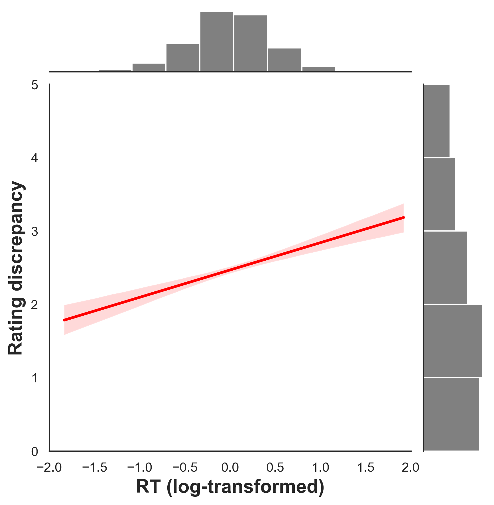

# Transfer bias social and spatial task

---
- Cleaning data and create project structure
- Folder structure

- Script to create datasets for each  orders, eliminating the
participants that did not performed well the task: (4MT Acc<0.3, and SpatialEgoTask<0.6)
   - scripting/preprocessing/DataSets.py  
   - scripting/preprocessing/DataSetsOrders.py

- Outputs:
  - `data/processed/allotask.csv`
  - `data/processed/egospatialtask.csv`
  - `data/processed/egosocialtask.csv`
  - `data/processed/df_summaryAgeGender.csv` 

- Scripting folder:
  - `scripting/preprocessing/`
  - `scripting/modelling/` : Folder for each experiment and the analysis runned to conect all the experiments
    # Experiment 1: Social Anchor Task
    - `scripting/modelling/egosocialtask/`
    
      In this folder we will have the scripts to run the models for the egosocial task
      - Model:
        ```r
        Model 1: RD ~ RTlog_cwc * Individual + (1 | PROLIFIC_PID) + (0+RTlog_cwc || PROLIFIC_PID)

        Model 2: RD ~ RTlog_cwc * Individual + (1 | PROLIFIC_PID)
        ```
      Out put from this models will save in the folder `/results/01SocialAnchor/`
      The df with the slopes random for each participants will be save in the folder `scripting/results/01SocialAnchor/AnchorSlopes_RTlog_byParticipant.csv`

      For the model 2: We save a image of this model in folder: `/results/01SocialAnchor/Model2_EgoSocialTask.png`

      ### Results Visualization:
      
      
      *Figure: Relationship between RT (log-transformed) and Rating discrepancy showing social anchoring bias effect.*

        Scripts2: egoSocialGraphs.py
          - This script will create the graphs for the egosocial task.

    # Experiment 2: Ego Spatial Task
    - `scripting/modelling/egospatialtask/`
      In this folder we will have the scripts to run the models for the egospatial task
      - Script 1: `anchorinhSpatialBias.R`
        ```r
        Model RT (LMM): RTlog ~ meanDistance_z * AD_z * Score_SpatialGeneral_z + (meanDistance_z  | PROLIFIC_PID)

        Model Acc (logit): Accuracy ~  meanDistance_z * AD_z * Score_SpatialGeneral_z +(meanDistance_z  | PROLIFIC_PID)
        ```

        Out put from this models will save in the folder `/results/02EgoSpatialAnchor/`
        The df with the slopes random for each participants will be save in the folder `scripting/results/02EgoSpatialAnchor/CoefsMixedLinearRT_meanDistance_egoTask.csv`

        For the model 2: We save a image of this model in folder: `/results/02EgoSpatialAnchor/Model2_EgoSpatialTask.png`

      - Scripts2: `egoSpatialGraphs.py`
          - This script will create the graphs for the egospatial task.

      - Scripts3: `CheckEgoSpatialTask.py`
          - Script to check egospatial features AD between conditions. 

    # Experiment 3: Allocentric Spatial Task
    - `scripting/modelling/allotask/binsangularDisparityCorr.py`: This script perform the individual level regression models for the allocentric spatial task.
    - `scripting/modelling/allotask/mixedModel4MT_linearEffect.R`: For the mixed models, the script will be runned in R.
      
      ## Linear regressions, agrupping by bins.
      Model 1
        ```r
        Model RT(4MT): RTlog ~ angularDisparity bins * Score_SpatialGeneral_z + (1| PROLIFIC_PID)
        ```
      Model 2:
        ```r
        Model Acc(4MT): Accuracy ~ angularDisparity bins * Score_SpatialGeneral_z + (1  | PROLIFIC_PID)
        ```
      Out put from this models will save in the folder `/results/03AllocentricAnchor/`
      I've tryied to apply a random slopes structure, but the model did not converge, so I will use a random intercepts structure.

      The linear slopes are calcualted just using a single participant regression model. The df with the slopes for each bins will be save in the folder `scripting/results/03AllocentricAnchor/LinearRegressionAngDisp_4MT.csv`

      - Mean Principal results: there is a negative correlation between the angular dispairty and RTS, and a positive correlation between the angular disparity and accuracy ( both aprroach confirm this results, single regression and mixed models).
      Cosa rayante: not explaing to much variance, but the results are significant.

      ## Quadratric regressions. 
    - `scripting/modelling/allotask/USHAPE_modelQuadratic.py`: single regression for each participant, to calculate the slopes for the quadratic term.

    - `scripting/modelling/allotask/mixedModel4MT_QuadraticEffect.R`
      Model 1
        ```r
        Model RT(4MT): RTlog ~ ADLinear* ADQuadratic * Score_SpatialGeneral_z + (ADQuadratic | PROLIFIC_PID)
        ```
      Model 2:
        ```r
        Model Acc(4MT): Accuracy ~ ADLinear* ADQuadratic * Score_SpatialGeneral_z + (ADQuadratic | PROLIFIC_PID)
        ```
      -the models are not convergin, so I will use a random intercepts structure, but i can't use this values to correlate with other experiments.
      

    # CONNECTION BETWEEN EXPERIMENTS

    - `scripting/modelling/ConnectionBetweenExperiment/`
    ## 1. Correlations between egoSocial and egospatial task: Correlations done:
        - RTmeanDistance_z with egocentric performance
        - AccmeanDistance_z with egocentric performance 
        - RTmeanDistance_z with social slopes
        - AccmeanDistance_z with social slopes
        - Individuals models social slopes with spatial slopes.
    
        Nothing significant found.

    ## 2.Correlations between 4MT  and egospatial task:
    List with all corelations performed
      ### LinearTerm models: 
        - RTmeanDistance_z with 4MT performance: significant effect, found a positive relantionship.
        - AccmeanDistance_z with 4MT performance: NOT significant effect.

        - RTmeanDistance_z with linearTerm Accuracy 4MT
        - RTmeanDistance_z with linearTerm RTS 4MT
        
        - AccmeanDistance_z with linearTerm Accuracy 4MT
        - AccmeanDistance_z with linearTerm RTs 4MT
       
      ### QuadraticTerm models: 
        - RTmeanDistance_z with quadraticTerm Accuracy 4MT
        - RTmeanDistance_z with quadraticTerm RTS 4MT

        - AccmeanDistance_z with quadraticTerm Accuracy 4MT
        - AccmeanDistance_z with quadraticTerm RTs 4MT

    ## 3. Correlations between 4MT and social task:
    `scripts/modelling/ConnectionBetweenExperiment/Correlation4MT_Social.py`
    List with all corelations performed
      ### LinearTerm models:  
        - social slopes with linearTerm Accuracy 4MT
        - social slopes with linearTerm RTS 4MT

       ### QuadraticTerm models: 
        - social slopes with quadraticTerm Accuracy 4MT
        - social slopes with quadraticTerm RTS 4MT